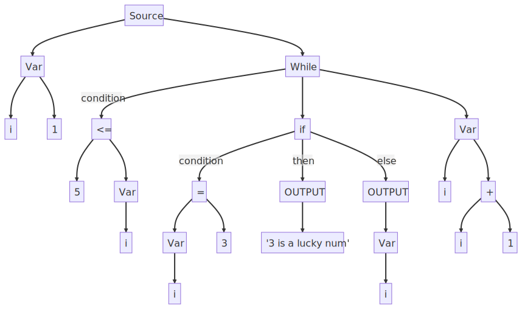

\pagebreak

**TODO:**

- [x] Analysis
  - [x] Produce a clear statement that describes the problem area and specific problem that is being solved or investigated.
  - [x] Provide background in sufficient detail for a third party to understand the problem being solved
  - [x] State for whom the problem is being solved
  - [x] Outline how you researched the problem
  - [x] Requirements determined based on the needs stated by the intended users of the system
  - [x] Produce a numbered list of measurable, specific objectives
  - [x] Report any modelling of the problem that will inform the design stage
- [x] Design
  - [x] A high-level overview of how different parts of the system interact
  - [x] User interface
  - [x] BNF notation
- [ ] Technical Solution
  - [ ] Code
  - [ ] Completeness
  - [ ] Techniques
- [ ] Evaluation
  - [ ] Consider and assess how well the outcome meets its requirements
  - [ ] Obtain independent feedback on how well the outcome meets its requirements
  - [ ] Discuss the independent feedback
  - [ ] Consider and discuss how the outcome could be realistically improved if you were to revisit the problem

**Other Todos**
 - [ ] monaco editor syntax highlighting, lsp stuff
- [ ] more detail in report to match reading speed
- [ ] make everything a class instead of a function
- [ ] show tokens list and ast in tests
- [ ] automatically add code section in nea

- [ ] mermaid diagrams
   - [ ] interpreter/translators (source) -> (intermediary code) -> (object code) -> (machine code) flowchart L-R
   - [ ] class diagrams
   - [ ] syntax diagrams

- [ ] language features
   - [ ] add arrays
   - [ ] minor changes to nea, adding For() class and in parser make it so variable() are based on if there is a VAR token and not by looking ahead for `->`.
   - [ ] add functions following book
  - [ ] constants
  - [ ] repeat loop
  - [ ] div and mod functions

**First**
- [ ] finish match statements refactor then push to PyPi then update site


\pagebreak

# Analysis

## Background

Pseudo-code is a series of code like statements used to describe an existing algorithm or plan out a new one. Everyone has their own unique style of writing pseudo-code. It might look something like a recipe books with clear individual steps to follow. Or it could look something like an existing high level language, with compilers or interpreters already available.

Pseudo-code is 'problem-oriented', writing it gives you room to focus on the problem. Then when the time comes to program a solution,  your brain is free to think about the specific implementation details in your language.

However this is a very different concept to *AQA pseudo-code*; where the code snippets in exam papers follow a specification. Since the specification is consistently applied, *AQA pseudo-code* looks practically the same everywhere it is used. The only thing stopping *AQA pseudo-code* from being a real language therefore, is the existence of a compiler or interpreter.

Some people may argue that having a compiler or translator available would be unnecessary as *AQA pseudo-code* is commonly exclusively used during examinations without a computer. Therefore having  a tool to generate machine code would not be needed. Where a working algorithm is needed it would be sufficient to manually translate *AQA pseudo-code* to an existing language where a compiler or translator is already available.

However, I believe a *AQA pseudo-code* translator would have many benefits. It could 

In this project I will investigate the feasibility of creating  an *AQA pseudo-code* tran

Pseudo-code varies in abstraction between clear english and lower level program code. The meaning of pseudo-code can be ambiguous. Do arrays start indexing starts at 0 or 1? Are for-range loops inclusive or exclusive? The imprecision of pseudo-code and natural language also cannot be solved by artificial intelligence, where the output of models like chat-gpt are impossible to guarantee correctness.

Therefore, this project will focus on AQA's specific style of 'pseudo-code' which is well defined and features a specification. Currently algorithms written in 'Pseudo-code' are difficult to check for correctness and needs to be manually hand traced to see the output. This is tedious and can often lead to mistakes. Often one would rewrite a 'pseudo-code' algorithm in a different language but that could of been done in the first place.

This problem could be solved if an AQA 'pseudo-code' translator was available. This would allow students to run their code to check for correct output. Teachers could better explain pseudo-code using the same step  by step 

And aid educators who could using It could also aid teachers who could demonstrate automatically tracing an algorithm using a debugger or aid examiners in marking. However the problem is mainly begin solved for students to aid learning.

## Research

I have chosen to involve as student named Reece in year 10, who is interested in testing my project. He is currently studying GCSE computer science and intents to take the A level. A so, he will be my primary end user. To research this problem I have chosen to produce a Questionnaire to gauge his needs. The responses were collected in person and have been summarised.

1. **What is your opinion on AQA 'pseudo-code'?**
   
   Using 'pseudo-code' is useful for learning programming, However it is impractical to use.

2. **How would a pseudo-code interpreter be useful in learning?**
   
   'pseudo-code' is used on exam papers, so having a good understanding of it is important. A 'pseudo-code' interpreter could make it easier to get to grips with the language. 

3. **how important is performance?, or is usability a more important factor?**
   
   Usability is more important, the solution should be user friendly before being fast.

4. **Should the program work in vscode/pycharm or be an online IDE?**
   
   I personally use vscode, so a vscode extension would be nice, and would integrate with my workflow, but I know other people use pycharm, which are on school computers, or the online IDE called repl.it

5. **If you want an online IDE**
   
   1. **Should be the default colour scheme be light or dark?**
      
      Every programmer prefers dark theme.
   
   2. **What colours should the syntax highlighting be?**
      
      I use atom syntax highlighting, I even have an extension for it in vscode.

6. **How should the program display errors?**
   
   The interpreter should tell the user what line the error was found on, and ideally a clear description on how to fix it.

7. **Other requirements?**
   
   I would like a translucent background because they look cool.

## Background

There are many different types of translators such as **Compilers**, **Interpreters** or **Transpilers**:

- **Compilers** first scan/tokenize the source code producing a list of tokens which are then parsed producing an intermediary format such as byte-code. This is then converted into *machine code*. For example the *clang* compiler for *C++* converts the source code to *LLVM byte-codes* which is then converted to standalone *machine code* for each system, for example *X-86*. However *Java byte-code* is distributed standalone and each system requires a *JVM* (Java Virtual Machine) installed to do the final conversion step to *machine code*.

- **Interpreters** scan and parse but the source code is executed statement by statement and converted to *machine code* on the fly. Interpreters are simpler to implement but can be slower than the final output of a compiled language.

- **Transpilers** scan and parse but the intermediary form is converted to another high level language where a compiler or interpreter already available. For example, the *Nim* programming language works by first transpiling to either *C*, *C++* or *Java-Script*.

- Other notes: languages can be expressed with regular grammar. Tools like yacc and lex are known as compiler compilers as they create a compiler given regular grammar of the language to be built as input. However I will not be using these and I am interesting in learning how an interpreter works.

## Analysis of existing solutions

Currently, there are no existing solutions for translating AQA 'pseudo-code'. However, I found two translators for IB 'pseudo-code'. One of them is website called [EZ Pseudocode](http://ibcomp.fis.edu/pseudocode/pcode.html), It is officially endorsed by the IB computer science page. The website is written entirely in *HTML* and *Java Script*, including the translation logic. This makes running programs feel snappy as the *Java-script* code runs client-side and does not have to wait on a network request. Moreover the website has the ability to save and load programs from the browsers cookies which is a nice feature.

However as noted in the comments of the sample program, the algorithm works by transpiling the users code into  *Java-script* using a basic find and replace. This is not very robust and can lead to many bugs. For example, if the user enters `output "/ mod /"`, you would expect the string `"/ mod /"` to be printed out. However instead the string `/ % /` is printed out. This is because the `translate` function in the code calls `line.replace()` To fix this bug an algorithm would need to tokenize the input which is much more complicated. 

```js
function translate(line) {
   line = line.replace(/ mod /g, " % ")    // The bug is here
    var lin = line.trim();
    var sp = lin.indexOf(" ");
    var first = "";
    if (startswith(lin, "if")) { first = "if" }
    ...
}
```

{width=85% align=centre}

Another solution, also for IB 'pseudo-code' is written by [Dep Jain](https://pseudocode.deepjain.com/). It is much more complicated and includes syntax highlighting and auto-completions powered by an open source project code editor called [ace](https://github.com/ajaxorg/ace). It defaults to dark mode which makes the website easier on the eyes. It has large buttons on the top and also has the ability to save and load files from the users cookies similar to the previous program. However the web page makes a *HTTP* request to a server to translate the code, making it closed source and also slower than the previous solution.

{width=85% align=centre}

Both programs are website, making it convenient as the user does not have to download any language tools. Website are also portable and can be accessed on any computer with an internet connection. Therefore I would consider developing a simple online IDE as well, second to a programmed solution.

Another disadvantage is that both solutions are limited to the IB computer science syllabus and not AQA's. Focusing my project on AQA's 'pseudo-code' will make my project unique. My solution should also be open source like the first example allowing the user to view the source code to better understand how their code was interpreted.

**Project Requirements**

1. Create a tree-walk interpreter for all the features in AQA's 'pseudo-code' command set including but not limited to: 
   
   - `REPEAT`, `WHILE`, `FOR`, `IF`, `RECORD`, `SUBROUTINE` constructs
   
   - `INPUT`, `OUTPUT`, `LEN`, `POSITION`, `SUBSTRING`, `RANDOM_INT` functions
   
   - `STRING`, `INT`, `REAL`, `BOOL` types
   
   - `INPUT`, `OUTPUT` operations
   
   - variables, constants and arrays
   
   If it is not possible to implement all of these features, the the language should at least be Turing complete. For a language to be considered Turing complete it needs at lease arithmetic operations, control flow (`WHILE` / `REPEAT` loops), and access to arbitrary memory (arrays)

2. Additionally I would like to make keywords case insensitive giving the use the ability to style code to his preference.

3. The program should accept a large range of input. For example the 'pseudo-code' command set uses the unicode multiply sign `(×)` whereas most programming languages use an `(*)` as it can be typed on a traditional keyboard. My program should accept both of these symbols, making it adaptable. A table of these special symbols is show below.
   
   | Traditional | Unicode |
   | :---------: | :-----: |
   |      *      |    ×    |
   |      /      |    ÷    |
   |     !=      |    ≠    |
   |     <=      |    ≤    |
   |     >=      |    ≥    |
   |     <-      |        |

4. Robust error handling, informing the user of what line syntax errors have occurred.

5. Create on online IDE for users to quickly try out the language without having to install any extra language tools their local machine.

6. Add syntax highlighting to highlight keywords and constructs, following the colours of the atom text editor, as it was my clients preference. 

# Design

## Language Choice

To translate 'pseudo-code' I am going ot build a *tree-walk* interpreter. The rough structure of my implementation is based on a book called *Crafting Interpreters* by *Robert Nystrom* which is written in *Java*. I have decided to use *Python* instead as it has a simple and readable syntax and is dynamically typed. This means I can re-use *python's* base types, which support string concatenation and integers of arbitrary precision meaning that integers will never overflow. *Python's* slower performance is not an issue as having a robust solution is higher priority and python is widely understood and is a popular language. Python is also multi-paradigm and supports OOP programming allowing me to model language constructs as classes, and functional programming which allows me to make my program more robust using pure functions with no side effects.

## High level system overview

Converting 'pseudo-code' to *machine code* is comprised of several stages. After the user's source code is read in from a file or *stdin* it is stored in a variable of type string and resides in memory. The first main stage is known as scanning of tokenizing where the alphabet of characters are grouped together to form tokens that represent the grammar and punctuation of the language.

During this stage lexical analysis is performed to group the right amount of characters into the right token. Some tokens are made up of single characters such as  (+) and (-). Whereas other tokens are made up of a set number of characters  such as FOR and IF.

STRING and  NUMBER literals are made up of a variable number of characters and need to be handled correctly. If the number 3 is found inside of a string, it should be treated as part of the STRING literal and not its own NUMBER literal. Therefore our scanner program will need to treat the same character differently depending on its state such as whether it has seen an opening `"` or `'`. The NUMBER literals include floats so the scanner should also handle decimal points correctly.

**Source code**

\

```aqa
   IDENTIFIER `i`
         |  ╭───── ASSIGNMENT token
         ↓  ↓
         i <- 1
         WHILE i <= 5
             IF i = 3                          ←─ INTEGER literal
                 OUTPUT "3 is a lucky number"  ←─ STRING literal
             ELSE                              ←─ ELSE token
                 OUTPUT i                      ←─ IDENTIFIER token
             ENDIF                             ←─ ENDIF token
             i <- i + 1
         ENDWHILE                              ←─ ENDWHILE token
      
```


**Table of tokens**

| Token      |         Value         |
| :--------- | :-------------------: |
| IDENTIFIER |          'i'          |
| ASSIGNMENT |                       |
| NUMBER     |           1           |
| WHILE      |                       |
| IDENTIFIER |          'i'          |
| LESS_EQUAL |                       |
| NUMBER     |           5           |
| IF         |                       |
| IDENTIFIER |                       |
| EQUAL      |                       |
| NUMBER     |           3           |
| PRINT      |                       |
| STRING     | '3 is a lucky number' |
| ELSE       |                       |
| PRINT      |                       |
| IDENTIFIER |          'i'          |
| END        |                       |
| IDENTIFIER |          'i'          |
| ASSIGNMENT |                       |
| IDENTIFIER |          'i'          |
| ADD        |                       |
| NUMBER     |           1           |
| END        |                       |
| EOF        |                       |


**Abstract Syntax Tree**




Looking in the table, the scanner has produced 18 separate tokens including an EOF (End Of File) token. The variable `i` also given a special  IDENTIFIER token. We can use a hashmap  data structure to store the value of `i` as it is incremented at the end of the for loop, so that it is printed correctly on the fifth line.

**Parsing**

The next step is parsing, where we convert the alphabet of tokens into expressions.  This will be modelled using an as an Abstract Syntax Tree (AST). This nesting of the nodes inside a tree allows us to represent the nesting or or *FOR* and *IF* blocks. As well as correctly defining the order of operations of expressions to follow BIDMAS.

To do this the parser could use two possible methods to recognise the start and end of out *FOR* and *IF* blocks. Method 1 involves counting indentation levels which would require our scanner to emit INDENT tokens matching tab character or spaces. This can be complicated and erroneous where the user inconsistently mixes tabs and spaces. However, it would make the use of *ENFOR* and *ENDIF* keywords optional. 

The second method is completely ignoring the indentation and only looking at the *ENDFOR* and *ENDIF* to determine the end of our *FOR* and *IF* blocks. This is simpler and less error-prone as it makes leading spaces or tab optional, but the user can still include them for readability. I also feel this method is more natural these *END* tokens are part of the AQA 'pseudo-code' specification anyway. So it is the method I'll chose to use.

That aside, after parsing our AST should look something like:

```julia
[OUTPUT, 1, +, 1] ─→ OUTPUT  # Keyword
                       |
                       +     # Binary operation
                      / \
                     1   1   # Numeric Literals
```

During this stage the parse performs syntactic analysis. The parser sees an `OUTPUT` token so it knows what follows has to be an expression. It matches the next three tokens to a binary operation. It then create tree data structure to represent the order of operations. The final stage is interpreting this tree.

```julia
[OUTPUT, 1, +, 1] ─→ OUTPUT  # Keyword
                       |
                       2     # Numeric Literals
```

The tree is interpreted from the leaves to the root. First, the operation  `1 + 1 = 2` is carried out. The tree now only has an `OUTPUT` token and the Numeric literal `2`. After this the `OUTPUT` function is performed displaying the value `2` to the user.  The tree for this line of code has now been completely evaluated. This process is then carried out for each corresponding statement in the users source code.

## Language syntax

Backus-naur (BNF) is useful notation for describing the grammar of languages. BNF is a series of rules, consisting of a head and a body making up a production. The head is on the LHS of the `'=>'` and the body is on RHS of the `'=>'`. A rule can either be *terminal* or *non-terminal*. A *terminal* production matches string literals, number literals or tokens. A *non-terminal* production matches other rules. Note: keywords are case insensitive so `PRINT` or `print` or any other casing is perfectly valid. Although this gives the user less options for valid variable names, this gives the language greater flexibility.

```aqa
program        => declaration* EOF

declaration    => varDecl | statement

statement      => printStatement | ifStatement |
                  whileStatement | forStatement

varDecl        => IDENTIFIER "<-" expression

printStatement => ( PRINT | OUTPUT ) expression

ifStatement
   => IF expression ( THEN | ":" )?
          declaration*
    ( ELSE 
          declaration* )?
    ( END | ENDIF )
eg IF True THEN
       ...
    ELSE
       ...
    ENDIF

whileStatement 
   => WHILE expression ( DO | ":" )?
         declaration*
    ( END | ENDWHILE )
eg WHILE True DO
        ...
    ENDWHILE

forStatement
   => FOR varDecl TO expression ( STEP expression )?
         declaration*
    ( END | ENDFOR )
eg FOR i <- 1 TO 5 STEP 2
        ...
    ENDFOR
    
# expression syntax
expression  =>  assignment
logic_or    =>  logic_and ( OR logic_and )*
logic_and   =>  equality ( AND equality )*
equality    =>  comparison ( ( "==" | "!=" ) comparison )*
comparison  =>  term ( ( ">" | ">=" | "<" | "<=" ) term )*
term        =>  factor ( ( "-" | "+" ) factor )*
factor      =>  unary ( ( "/" | "*" ) unary )*
unary       =>   ( NOT | "-" ) unary |  primary
primary     =>   INTEGER | REAL | STRING | None |
                 True | False | "(" expression ")"
```

## User Interface

My program will have a basic command line interface. It should let the user pick from running the program via the Read Eval Print Loop (REPl), passing in the program as a string, or reading in the program as a file. The program should also display a helpful message when the program is called with the `---help` flag. Below shows a draft of what this might look like.

```bash
# display help message
$ python aqainterpreter.py --help
Usage: aqainterpreter.py [OPTIONS] [FILENAME]

Options:
  -c, --cmd TEXT
  --help          Show this message and exit.


# incorrect usage
`$` python aqainterpreter.py filename -c cmd
Usage: aqainterpreter.py [OPTIONS] [FILENAME]
Try 'aqainterpreter.py --help' for help.

Error: cannot specify both filename and cmd at same time

# starting the repl (read-eval-print-loop)
$ python aqainterpreter.py
> OUTPUT 'Hi!'
Hi!

# program read in from file
$ python aqainterpreter.py input.txt
Hi!

# program passed in as a string
$ python aqainterpreter.py --cmd "OUTPUT 'Hi!'"
Hi!
```

Additionally, If I create an online IDE I will need to create a web site using *html* and *css*. The client side webpage will need to communicate to the server over the *HTTP* protocol. Which sends the users source code to the server. The server will need to interpret the code by running the `aqainterpreter.py` program, and send the output back to the client.

# Technical Solution

## **Project structure**

<!-- tree -I playground -I report -I input.txt -I out.pdf -v -->

```
.
├── AQAInterpreter
|   ├── __about__.py
|   ├── __init__.py
|   ├── environment.py
|   ├── errors.py
|   ├── interpreter.py
|   ├── main.py
|   ├── parser.py
|   ├── scanner.py
|   ├── tests.py
|   └── tokens.py
├── .gitignore
├── LICENSE
└── pyproject.toml
```

## **environment.py**


```python
from AQAInterpreter.errors import *
from dataclasses import dataclass, field


@dataclass
class Environment:
    values: dict[str, object] = field(default_factory=dict)

    def get(self, name: Token) -> object:
        if name.lexeme in self.values:
            return self.values[name.lexeme]

        raise AQARuntimeError(name, f"undefined variable '{name.lexeme}'")

    def define(self, name: str, value: object) -> None:
        self.values[name] = value 
```